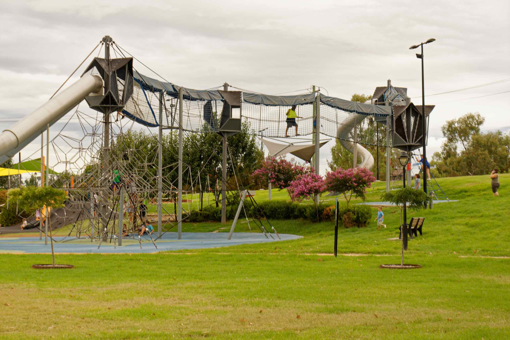

Tamworth Regional Playground and the adjoining Bicentennial Park forms a green stretch just south of Tamworth central business district and follows the bank of the Peel River.

There is a playground for the young kids, as well as plenty of open space for them to run around. There are also several sporting fields and a swimming pool in the area.

Near the duck pond there is a statue celebrating the Australian horses that went to the early wars we were involved in, but never returned. There is also some other war memorials in the park.

Located at the entrance to Bicentennial Park is Pioneer's Parade, a row of busts featuring some of Australia’s best loved music legends.

The first unveiling in January 1991 was a privately funded bust honouring Buddy Williams, followed just six months later by a likeness of Tex Morton.

Since then, industry legends including  Barry Thornton, Stan Coster, Reg Lindsay, Jimmy Little, Shirley Thoms and Chad Morgan have been commemorated here. A bust of Frank Ifield was installed in January, 2019, and fundraising is underway for the next installation – Brian Young OAM by sculptor Peter Latona.

There is a row of Busts of some of the stars that are jamming away in Country music heaven, as well as a stage for the up and coming stars.
