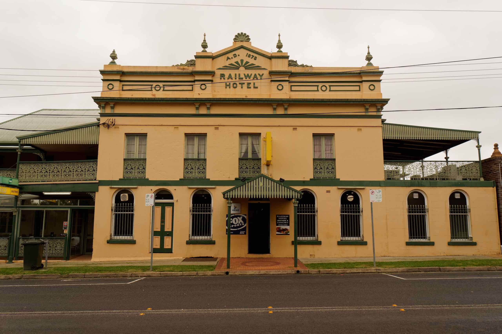

This is the companion to the heritage walk.

We did not stop at all the locations listed in the guide, but the key ones are:

- St Mary's Anglican Church
  
- Johnson and Kennedy Service Station
  
- Armidale Train Station
  
- Crossword Cafe
  
- Railway Hotel
  
- Armidale Cemetery
  
- St. Patrick's Orphanage
  
- Apex and Drummond Lookout
  
- O'Connor Catholic College
  
- The Armidale School
  

Armidale was officially declared a town in 1846. A few years later, the arrival of the railway and discovery of gold at Rocky River and Hillgrove heralded a population and building boom. Valuable minerals and metals, including tin, were discovered at other sites around the region and hundreds of Chinese joined the workforce, adding another dimension to the cultural mix.

Back in the old days, bushrangers were notorious for disrupting the bucolic pastoral scene. The antics of Frederick Ward (alias, Captain Thunderbolt), for instance, are legendary here. Ward’s stellar career in highway robbery came to an end when he was shot by police at Kentucky Creek in 1870. Or was he? Controversy about who was actually killed on that day has been hotly debated ever since. On display at McCrossin’s Mill Museum in Uralla (a fine example of a late-19th century commercial building) is a fascinating collection of Thunderbolt memorabilia and displays that reveal stories about the area’s gold mining heyday and wool industry history. Thunderbolts Cave is just south of Guyra off the New England Highway.

It was a prosperous few decades and Armidale’s heritage architecture, in particular, reflects the grand ambitions of those late 19th-century settlers. The Anglican and Catholic cathedrals were among the earliest buildings to grace the centre of town, along with the stately post office, state bank and courthouse, all still in use today.
