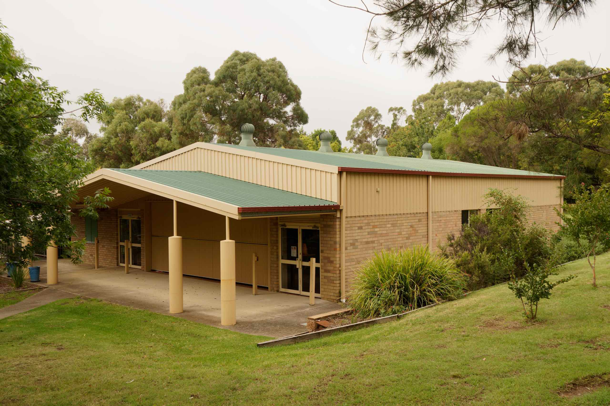
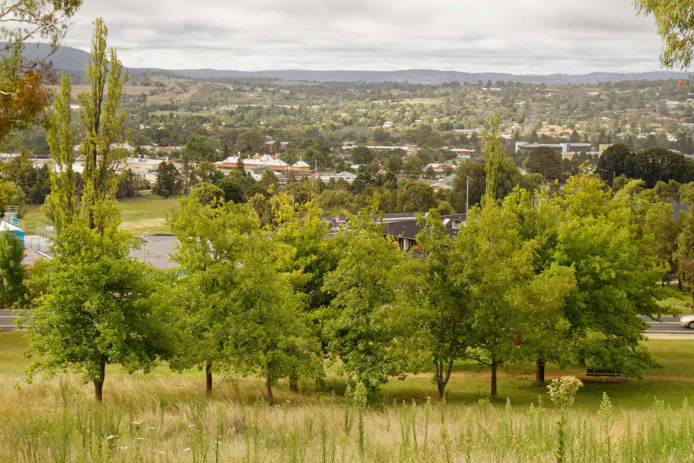

The main locations we have not visited are Martins Gully School and the Arboretum, plus a few others

Armidale Bicentennial Arboretum is a heritage listed park bounded by Kentucky, Butler and Galloway streets.

It contains thousands of native and imported shrubs and trees, walking tracks, a north-facing lookout, picnic shelters, a toilet block and aquatic gardens with a waterfall and footbridge.

There is also a sensory garden near the entrance and a new children's playground was erected in 2016.

After that, we went to the the Whitebull Hotel for dinner. I noticed some street art in an alleyway opposite the hotel.
